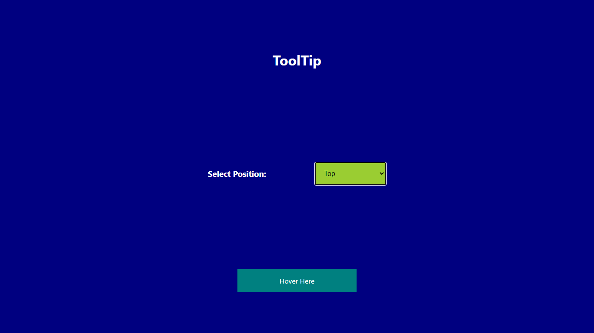

# Read Me Template

> A simple tooltip Porject made using React. The project is hosted at: https://tooltip-15370.web.app/

---

### Table of Contents
You're sections headers will be used to reference location of destination.

- [Description](#description)
- [How To Use](#how-to-use)
- [Author Info](#author-info)

---

## Description

This is a tooltip made using React. You can Hover over the div whicch says 'Hover Here' and then the tool tip will be displayed in the position selected by you. The project is hosted at: https://tooltip-15370.web.app/

#### Technologies

-React

---

## How To Use

#### Installation
Just clone the repository to your system and run npm install to install all the dependencies. After that just run npm run to deploy the App and visit it on the URL: http://localhost:3000/

---

## Author Info

- LinkedIn - [@lakshdhamija](https://linkedin.com/in/laksh-dhamija)